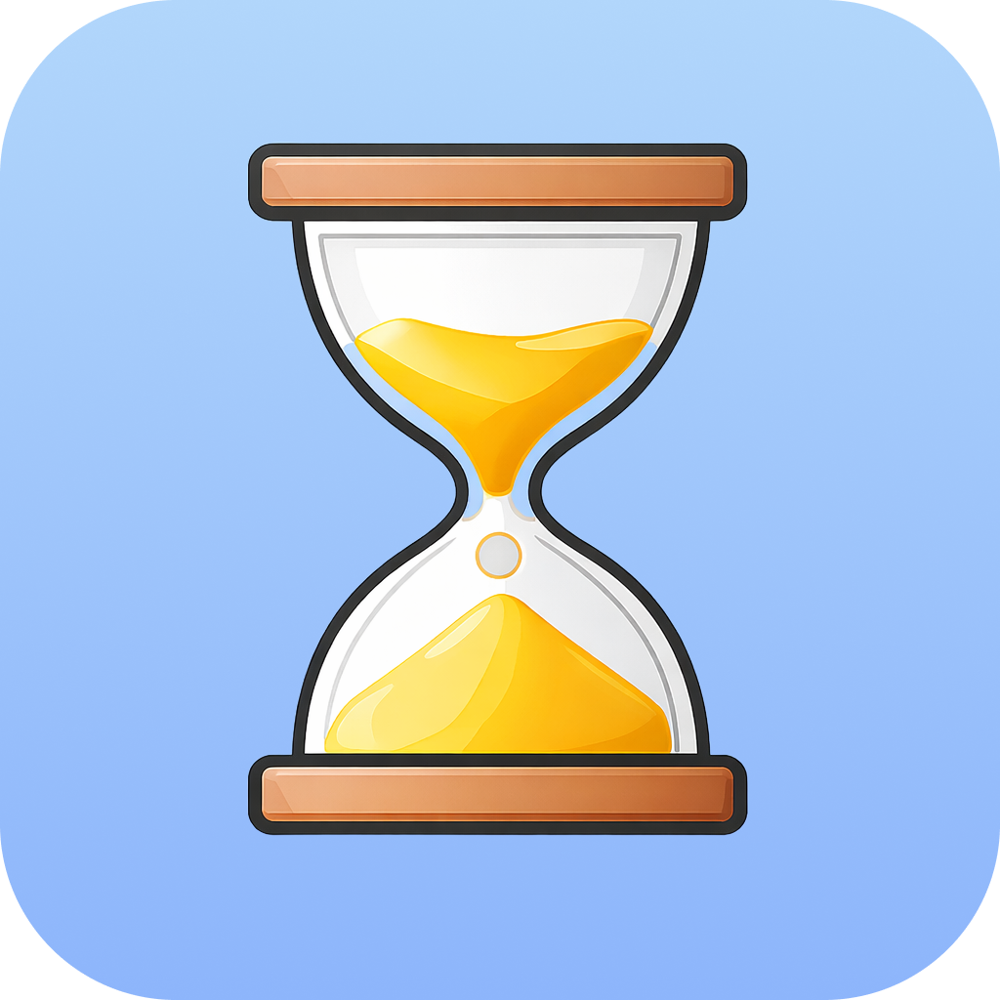

# Tock



Super-minimal  menu bar timer with natural-language parsing, stopwatch mode, and configurable repeating tones.

## Features

- Menu bar countdown timer and stopwatch with natural-language input.
- Flexible notifications: multiple tones, repeat behavior, volume, and default units.
- Context (right-click) menu with most app controls, plus popover UI.
- Customizable global keyboard shortcuts for common actions.

## Installation

1. Download the latest macOS build:

   [](https://github.com/edelstone/tock/releases/latest/download/Tock.dmg)

2. Drag `Tock.app` to `/Applications`.
3. If macOS warns that the app is damaged or can’t be opened (Gatekeeper), this is usually due to the quarantine flag applied to apps downloaded outside the App Store. You can remove the flag for Tock only by running:

   ```bash
   xattr -dr com.apple.quarantine /Applications/Tock.app
   ```

4. Optional: add the app to your login items via **System Settings → General → Login Items**.

## Usage

- Enter a duration like `10`, `5m`, `1.5h`, `45 sec`, `17m 45s`, or `25:00`, then press Enter to start.
- Enter a time of day like `10pm`, `6:15a`, or `noon` to count down until the next occurrence.
- Click the play button to start a stopwatch with no countdown.
- Clear stops the timer and silences any active alarm.
- Quit via context (right-click) menu or open the popover and type ⌘-Q.
- Configure notifications and keyboard shortcuts in Settings.

## Default shortcuts

- Open popover: ⌃⌥⌘T
- Clear timer: ⌃⌥⌘X

## Releasing

See [docs/RELEASING.md](docs/RELEASING.md) for the full release and personal dev workflow.

## Credits

All sounds from [Notification Sounds](https://notificationsounds.com).

## License

MIT — free for commercial and personal use.
